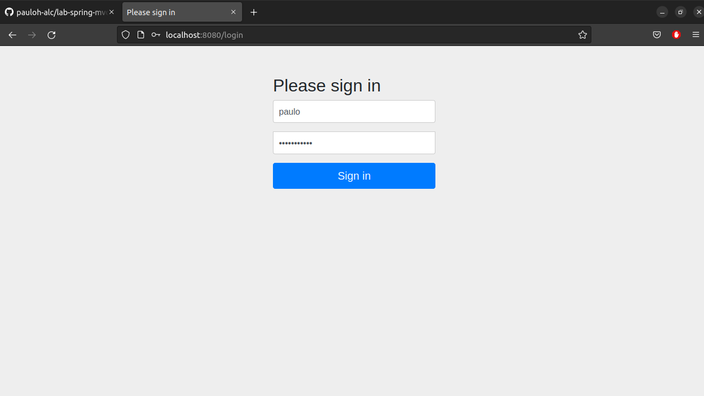
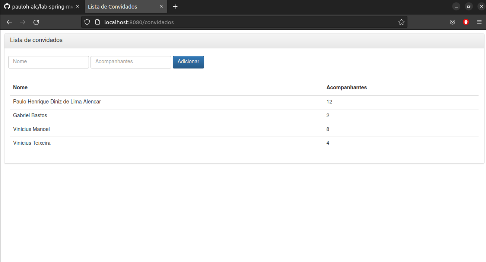
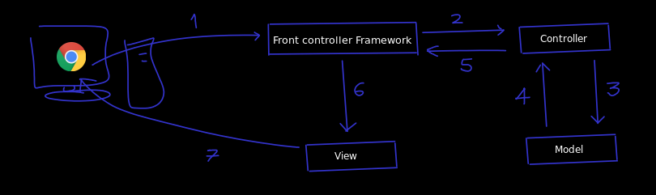

# lab-spring-mvc
Repositório de estudos para criação de Aplicações Web em java, utilizando Java Spring MVC.

## Projetos:

Os projetos criados nesse repositório foram desenvolvidos seguindo algum material de leitura digital ou através de vídeos. Projetos pessoais são colocados em repositórios individuais. 

1. Gestão de festas

* Objetivo: começar ententer o padrão de projeto MVC.
* O que foi abordado: 
-- Criação de uma classe no pacote controller chamada ConvidadosController composta por dois métodos.
-- Os métodos foram assinados com as anotações @GetMapping e @PostMapping com o objetivo de mapear quais métodos iriam responder a determinadas requisições.
-- Ainda na classe que representa o controller (intercepta requisições) foi criado um atributo de instância chamado convidados assinado com a anotação @Autowired para a injeção de dependência.
-- A classe Convidado presente no pacote model, representa um dos elementos do Model, uma classe bem simples, sem regras muitas regras e composta por três campos.
-- Uso de uma interface chamada Convidados que extend de JpaRepository
-- A View do projeto está presente em src/main/resource/templates, que possui apenas um arquivo .html que faz uso do bootstrap e thymeleaf
-- O aquivo application.properties possui algumas configurações básicas relacionada ao thymeleaf e a configuração da URL, nome e senha da base de dados.
-- Esse projeto possui também um arquivo import.sql que foi usado para criação de uma in-memory database. Porém, o arquivo application.properties está configurado para criar uma base de dados chamada festa no MySQL.  

2. Cadastro de Jedi - básico
- Objetivo: começar ententer o padrão de projeto MVC.
- O que foi abordado:

1 - Gestão de festas - tela de autenticação

2 - Gestão de festas - tela de exibição e cadastro

## Conceitos iniciais

- Spring: não é um framework apenas, mas um conjunto de projetos (o spring seria mais um Ecossistema).
- Spring Framework: é apenas um, dentre todo conjunto de projetos que o spring possui (principais funcionalidades - spring MVC, suporte para JDBC, JPA, injeção de dependências [dependency injection - DI]).
- Injeção de dependências: é um tipo de inversão de controle (ou Inversion Of Control - IoC) que dá o nome ao processo de prover instâncias de classes que tem um objeto que precisa para funcionar.
- Observações: O Spring Framework é a base do ecossistema e a injeção de dependências é a base do spring Framework (vantagem: baixo acoplamento e flexibilidade).
- Spring boot: analisa o projeto e automaticamente o configura.
- Spring Security: projeto que trata da segurança em nível de aplicação.
- Thymeleaf: não é um projeto Spring, mas uma biblioteca que foi criada para facilitar a criação da camada de view.
- Maven: gerenciador de dependências.
- Spring Tool Suit: STS é um eclipse com vários plugins úteis para trabalho com o Spring.
- MVC: padrão de projeto de software.
- REST: é um estilo arquitetural escrito em cima do HTTP e composto por determinadas regras.

## Spring MVC

- Vantagem: desenvolvimento de aplicações web ROBUSTAS, FLEXÍVEIS e com uma clara SEPARAÇÂO de RESPOSABILIDADES nos papéis do tratamento da requisição.
- MVC: Model, View e Controller

## Parte teórica do MVC

Geralmente abrimos o browser, isto é, um user agent, digitamos um endereço na "barra de endereços" e em seguida damos um "enter". Se por acaso nada der errado, uma página HTML será renderizada.

Mas o que acontece entre o "enter" e a página HTML renderizada?

- O contexto do Spring MVC:

- 1: Acessamos uma URL pelo browser, que envia a requisição HTTP para o servidor que roda a aplicação web com Spring MVC. Esse servidor pode ser o Apache Tomcat, por exemplo. Perceba que quem recebe a requisição é o controlador do framework, o Spring MVC.

- 2: O controlador do framework irá procurar qual classe é responsável por tratar essa requisição, entregando a ela os dados enviados pelo browser. Essa classe faz o papel de controller.

- 3: O controller passa os dados para o model, que por sua vez executa todas as regras de negócio, como cálculos, validações e acesso ao banco de dados.

- 4: O resultado das operações realizadas pelo model é retornado ao controlle.

- 5: O controller retorna o nome da view, junto com os dados que ela precisa para renderizar a página.

- 6: O framework encontra a view, que processa os dados, transformando o resultado em um HTML.

- 7: Finalmente, o HTML é retornado ao browser do usuário.

Obs: esse exemplo foi retirado de um pdf gratuíto fornecido pela empresa Algaworks.

- Controller: intercepta as requisições/trata as requisições.
- Model: possui regras de negócios, acessando banco de dados ou fazendo validações nessa camada.  
- View: vai "desenhar", renderizar e transformar em HTML os dados, para que o usuário consiga visualizar as informações, pois enquanto estavam no controller e no model, estávamos trabalhando com classes Java, e não em algo visual para browser exibir ao usuário.

## Criação de controller
