# lab-spring-mvc
Repositório de estudos para criação de Aplicações Web em java, utilizando Java Spring MVC.

## Projetos:

Os projetos criados nesse repositório foram desenvolvidos seguindo algum material de leitura digital ou através de vídeos. Projetos pessoais são colocados em repositórios individuais. 

1. Gestão de festas

* Objetivo: começar ententer o padrão de projeto MVC.
* O que foi abordado: 
    1. Criação de uma classe no pacote controller chamada ConvidadosController composta por dois métodos.
    2. Os métodos foram assinados com as anotações @GetMapping e @PostMapping com o objetivo de mapear quais métodos iriam responder a determinadas requisições.
    3. Ainda na classe que representa o controller (classe intercepta requisições) foi criado um atributo de instância chamado convidados assinado com a anotação @Autowired para a injeção de dependência.
    4. A classe Convidado presente no pacote model, representa um dos elementos do Model, uma classe bem simples, sem regras muitas regras e composta por três campos.
    5. Uso de uma interface chamada Convidados que extend de JpaRepository
    6. A View do projeto está presente em src/main/resource/templates, que possui apenas um arquivo .html que faz uso do bootstrap e thymeleaf
    7. O aquivo application.properties possui algumas configurações básicas relacionada ao thymeleaf e a configuração da URL, nome e senha da base de dados.
    8. Esse projeto possui também um arquivo import.sql que foi usado para criação de uma in-memory database. Porém, o arquivo application.properties está configurado para criar uma base de dados chamada festa no MySQL.  

1 - Gestão de festas - tela de autenticação

2 - Gestão de festas - tela de exibição e cadastro

2. Cadastro de Jedi - básico
* Objetivo: começar ententer o padrão de projeto MVC.
* O que foi abordado:
    1. Criação de uma classe no pacote controller chamada JediController composta por três métodos.
    2. Dois métodos foram assinados com a anotação @GetMapping e um com o @PostMapping. O objetivo era mapear quais métodos iriam responder a determinadas requisições do usuário. Por exemplo, se a requisição GET fosse para o /jedi o método jedi() {...} "iria atender". Se fosse /new-jedi o método newJedi() {...} iria "atender" essa requisição. E por fim, se fosse uma requisição POST feita para o /jedi o método createJedi iria "atender"
    3. Ainda na classe qque representa o controller (classe que intercepta requisições) foi criado um atributo chamado convidados assinado com a anotação @Autowired para a injeção de dependência.
    4. A classe Jedi presente no pacote model, representa um dos elementos do Model.
    5. A classe JediRepository presente no pacote repository possui uma lista que vai armazenar cada jedi cadastrado.
    6. A View do projeto está presente em src/main/resource/templates, são os dois arquivos HTML que possui somente código html e utiliza thymeleaf.

1 - Cadastro de Jedi - tela de cadastro
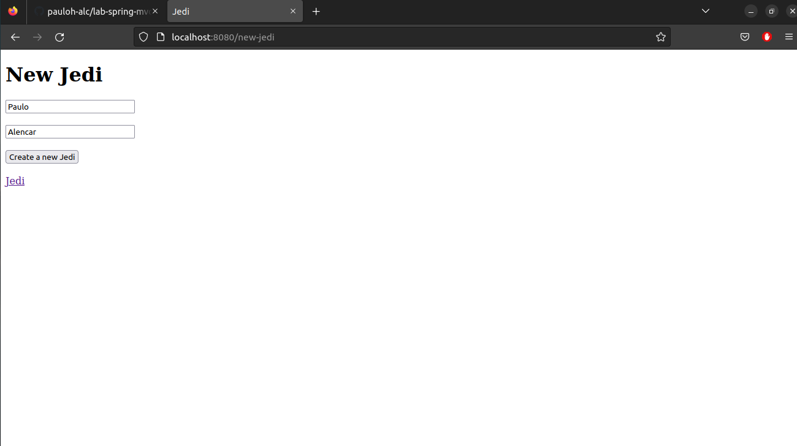
2 - Cadastro de Jedi - tela de exibição
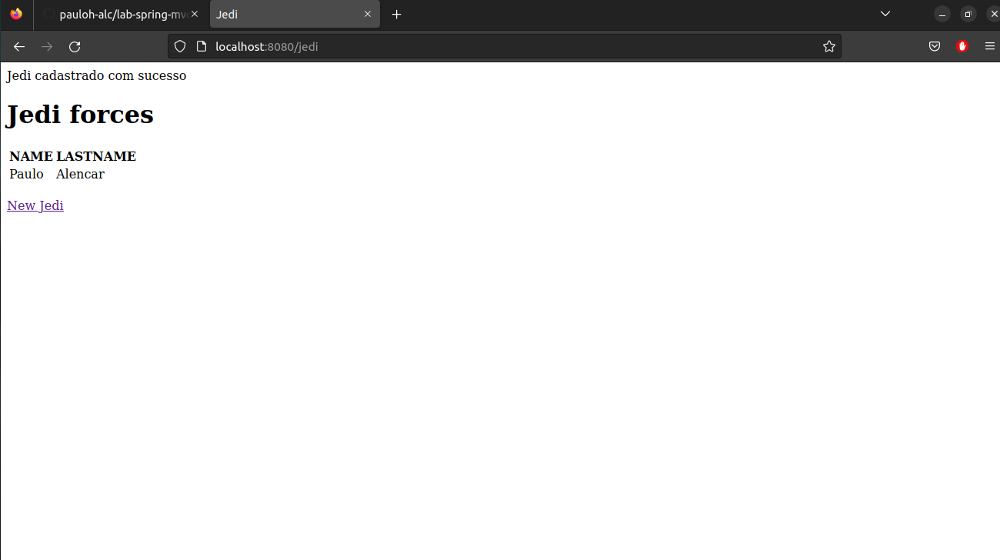

3. Cadastro de Jedi - data & validator
* Objetivo: começar a entender o padrão de projeto MVC.
* O que foi abordado:
    1. Criação de uma classe no pacote controller chamada JediController composta por 6 métodos.
    2. 5 métodos foram anotados com @GetMapping (jedi, createJedi, search, deleteJedi, updateJedi) e 1 método com o @PostMapping (createJedi)
    3. Se uma requisição GET for para /jedi o método jedi() {...} é chamado. Se a requisição GET for para /newJedi create createJedi() {...} é chamado. Se uma requisição POST for feita para /jedi, createJedi() {...} é chamado. Se for uma requisição GET para /search o método jediSearch é chamado. Se for uma requisição GET para /jedi/{id}/delete o método deleteJedi será chamado. E por fim, se for uma requisição GET para /jedi/{id}/update o método updateJedi será chamado.
    4. Na pasta src/main/resource/templates foi adicionado outro elemento para o View do projeto, o arquivo edit-jedi.html

1 - Cadastro de Jedi - tela de Listagem
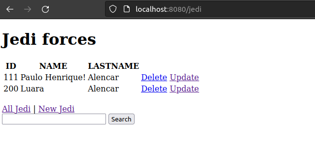
2 - Cadastro de Jedi - tela de Edição de Jedi
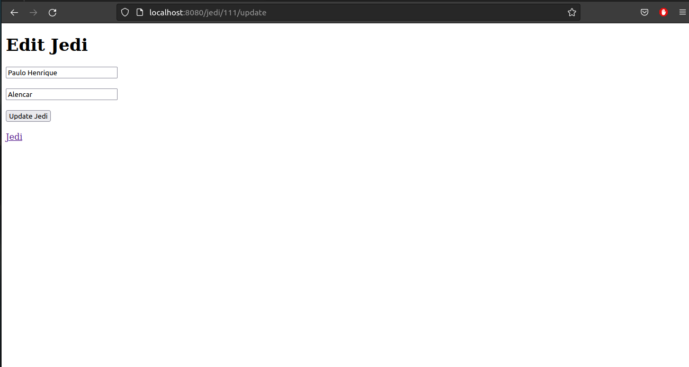

4. CRUD - API REST para Jedi
* Objetivo: começar entender o estilo arquitetural REST
* O que foi abordado:
    1. Criação dos seguintes endpoints GET: /api/jedi, /api/jedi/{id}, POST: /api/jedi, PUT: /api/jedi/{id}, DELETE: /api/jedi/{id}
    2. No modelo rest não foi utilizado interface web, mas sim o uso de um cliente HTTP, i.e, Postman
    3. Para criar recursos foi utilizado -> POST; Para recuperar recursos foi utilizado -> GET; Para atualizar recursos foi utilizado o PUT e para deletar recursos foi utilizado o DELETE.

1 - GET - 
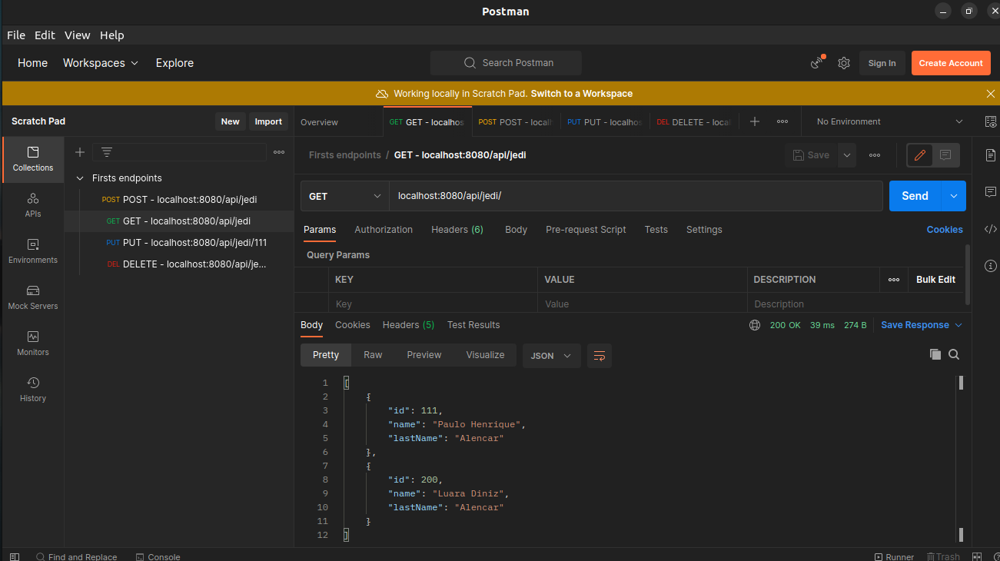
2 - GET de um Jedi específico - 
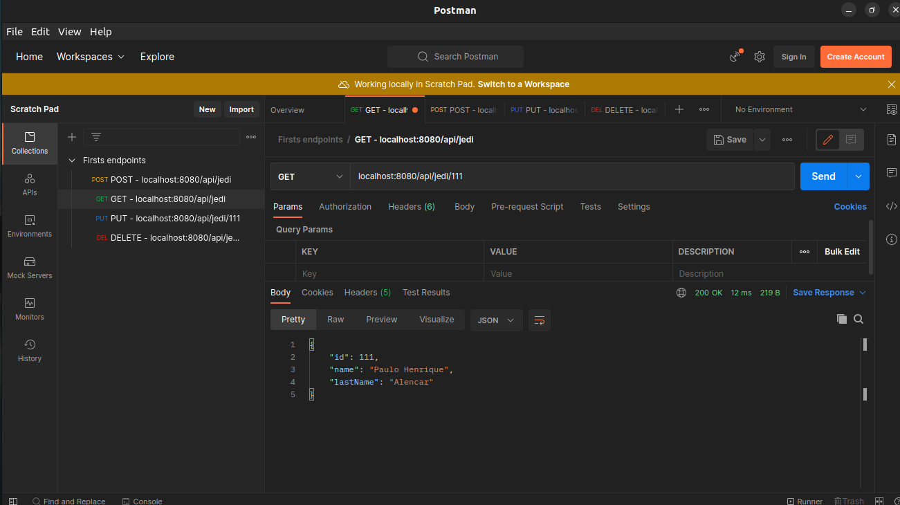
3 - POST - 
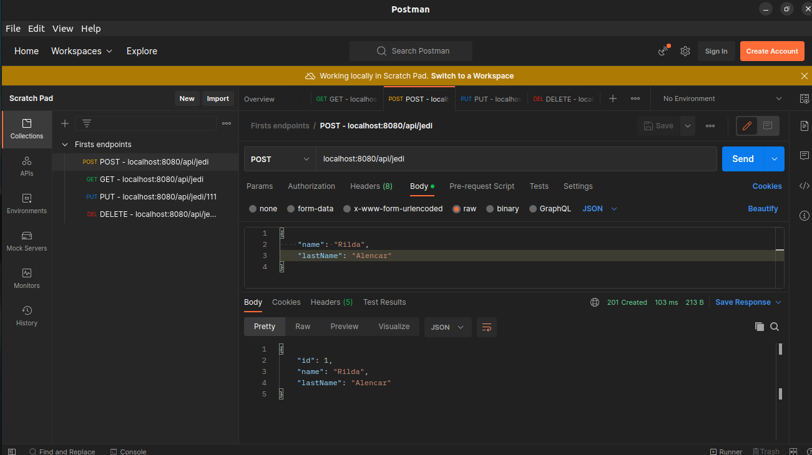
4 - PUT - 
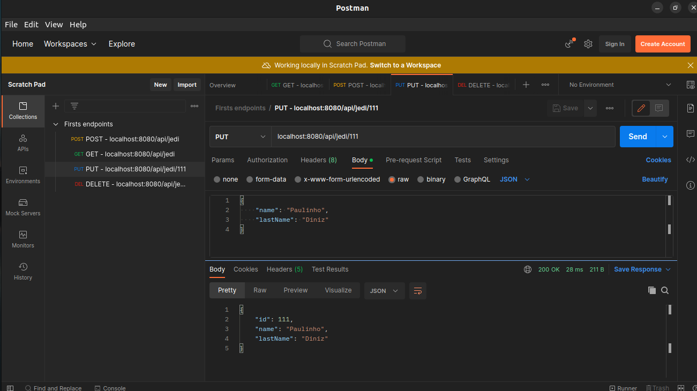
5 - GET após fazer um PUT 
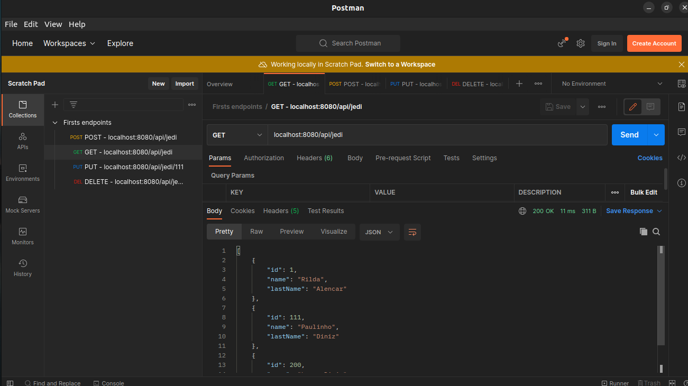
6 - DELETE  
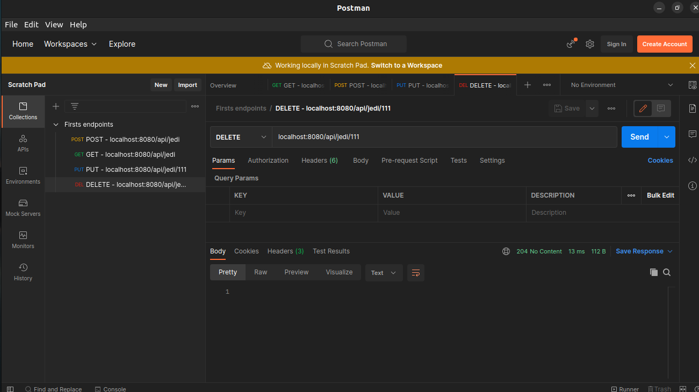
7 - GET após fazer um DELETE  
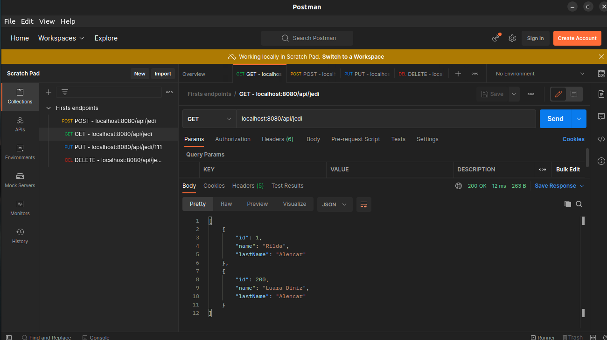

5. Refatorando projeto 4 - API REST
* Objetivo: começar a entender o estilo arquitetural REST;
* O que foi feito:
    1. Refatoração. Foi criado uma classe chamada JediService para organizar melhor o projeto. 
    2. Criação da Classe ResourceAdvice, assinada com @ControllerAdvice - essa classe possui um método assinado com duas anotações, a primeira é @ResponseStatus e a segunda ExceptionHandler. Essas duas anotações serão importante quando algum recurso não for encontrado, fazendo com que o método retorne o status 404 - NOT FOUND

6. Criação de aplicação REST com Spring Web MVC
* Objetivo: desenvolver um serviço Web estilo Spring Boot REST para lidar com operações CRUD de um banco de dados H2 na memória.
* O que foi abordado: basicamente foi criado um controlador REST para criar os seguintes endpoints da API REST: GET /v1/soldado para listar todos os soldados; GET /v1/soldado/{id} para encontrar um soldado cujo id={:id}; POST /v1/soldado para salvar um soldado; PUT /v1/soldado/{id} para atualizar um soldado onde id={:id}; DELETE /v1/soldado/{id} para deletar um soldado onde id={:id}

1 - GET /v1/soldado
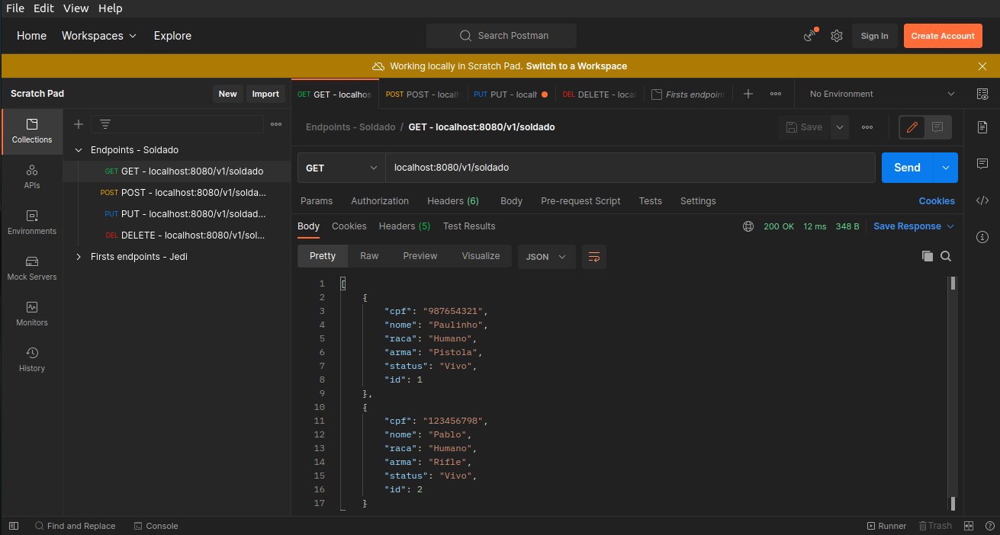
2 - GET /v1/soldado/{id}
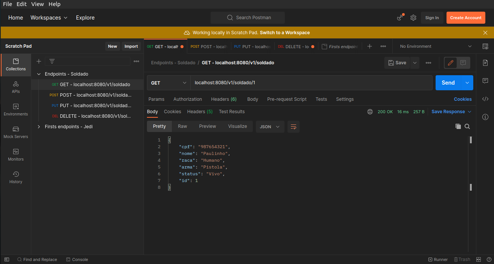
3 - POST /v1/soldado
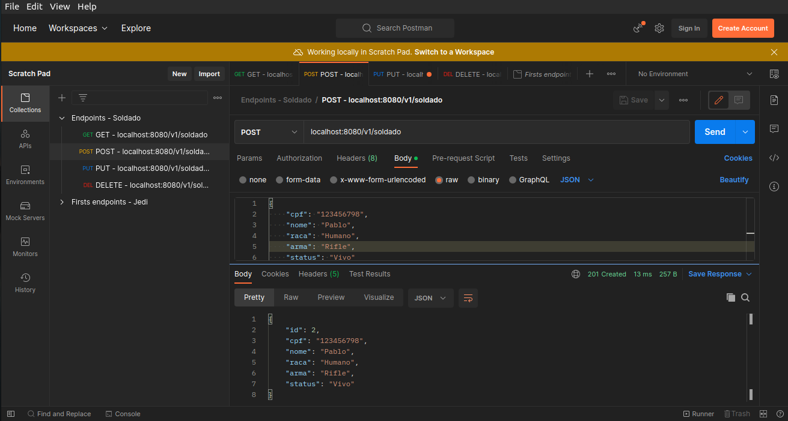
4 - PUT /v1/soldado/{id}
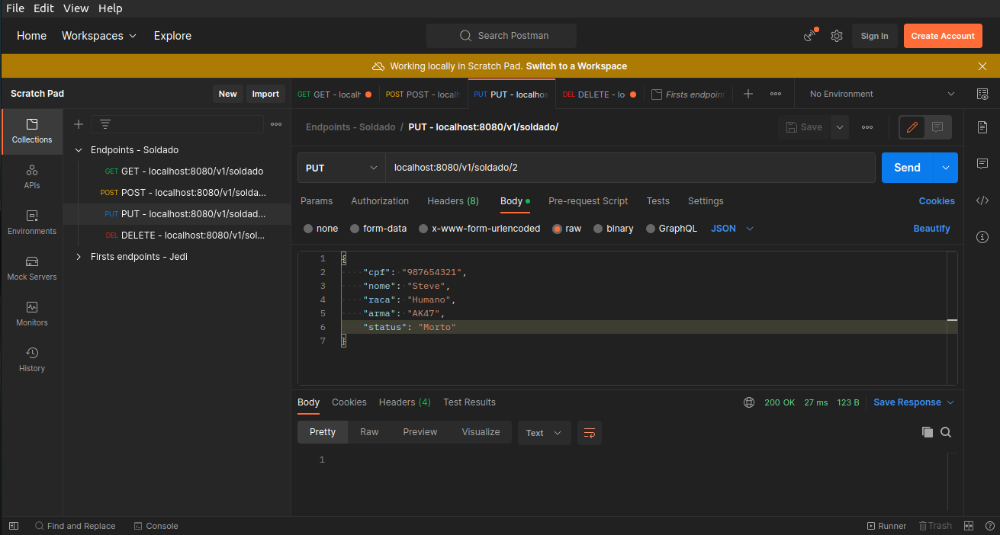
5 - GET /v1/soldado após PUT
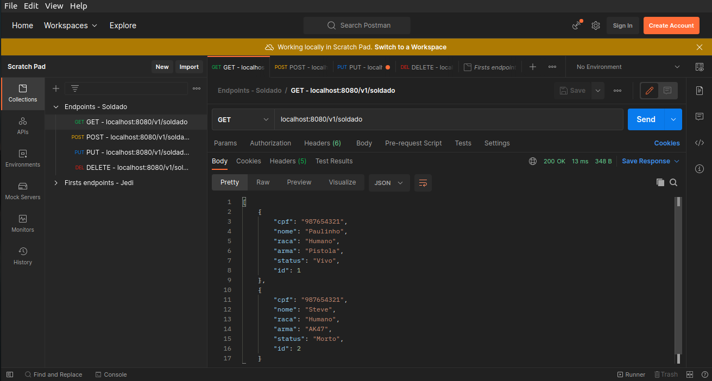
6 - DELETE /v1/soldado/{id} 

## Conceitos iniciais

- Spring: não é um framework apenas, mas um conjunto de projetos (o spring seria mais um Ecossistema).
- Spring Framework: é apenas um, dentre todo conjunto de projetos que o spring possui (principais funcionalidades - spring MVC, suporte para JDBC, JPA, injeção de dependências [dependency injection - DI]).
- Injeção de dependências: é um tipo de inversão de controle (ou Inversion Of Control - IoC) que dá o nome ao processo de prover instâncias de classes que tem um objeto que precisa para funcionar.
- Observações: O Spring Framework é a base do ecossistema e a injeção de dependências é a base do spring Framework (vantagem: baixo acoplamento e flexibilidade).
- Spring boot: analisa o projeto e automaticamente o configura.
- Spring Security: projeto que trata da segurança em nível de aplicação.
- Thymeleaf: não é um projeto Spring, mas uma biblioteca que foi criada para facilitar a criação da camada de view.

- Maven: gerenciador de dependências.
- Spring Tool Suit: STS é um eclipse com vários plugins úteis para trabalho com o Spring.
- MVC: padrão de projeto de software.
- REST: é um estilo arquitetural escrito em cima do HTTP e composto por determinadas regras.

## Spring MVC

- Vantagem: desenvolvimento de aplicações web ROBUSTAS, FLEXÍVEIS e com uma clara SEPARAÇÂO de RESPOSABILIDADES nos papéis do tratamento da requisição.
- MVC: Model, View e Controller

## Parte teórica do MVC

Geralmente abrimos o browser, isto é, um user agent, digitamos um endereço na "barra de endereços" e em seguida damos um "enter". Se por acaso nada der errado, uma página HTML será renderizada.

Mas o que acontece entre o "enter" e a página HTML renderizada?

- O contexto do Spring MVC:

- 1: Acessamos uma URL pelo browser, que envia a requisição HTTP para o servidor que roda a aplicação web com Spring MVC. Esse servidor pode ser o Apache Tomcat, por exemplo. Perceba que quem recebe a requisição é o controlador do framework, o Spring MVC.

- 2: O controlador do framework irá procurar qual classe é responsável por tratar essa requisição, entregando a ela os dados enviados pelo browser. Essa classe faz o papel de controller.

- 3: O controller passa os dados para o model, que por sua vez executa todas as regras de negócio, como cálculos, validações e acesso ao banco de dados.

- 4: O resultado das operações realizadas pelo model é retornado ao controlle.

- 5: O controller retorna o nome da view, junto com os dados que ela precisa para renderizar a página.

- 6: O framework encontra a view, que processa os dados, transformando o resultado em um HTML.

- 7: Finalmente, o HTML é retornado ao browser do usuário.

Obs: esse exemplo foi retirado de um pdf gratuíto fornecido pela empresa Algaworks.

- Controller: intercepta as requisições/trata as requisições.
- Model: possui regras de negócios, acessando banco de dados ou fazendo validações nessa camada.  
- View: vai "desenhar", renderizar e transformar em HTML os dados, para que o usuário consiga visualizar as informações, pois enquanto estavam no controller e no model, estávamos trabalhando com classes Java, e não em algo visual para browser exibir ao usuário.

## Criação de controller 

